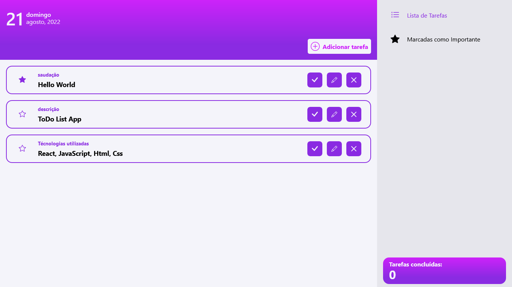

<h1 align="center">
    
</h1>

<h2 align='center'><a href='https://wendellwcl.github.io/ToDo-App/' target='_blank' style='display: block; color: #8A2BE2; font-weight: bold; margin: 30px'>Visitar projeto.</a></h2>

<h2 style='color: #8A2BE2'>Descrição do projeto:</h2>

    A motivação para o desenvolvimento desta aplicação veio durante a realização de outros projetos, quando senti a necessidade de ter um meio onde pudesse registrar e gerenciar tarefas, ideias, etc. Me preocupei bastante em desenvolver algo que entregue uma boa experiência ao usuário, sendo simples de entender e utilizar. Sua funcionalidade gira em torno do conceito CRUD: Create, Read, Update e Delete, possuindo também a mecânica de 'Confirmação de Duas Etapas', para que ações acidentais não tenham efeitos.
    <a href='https://wendellwcl.github.io/ToDo-App/' target='_blank' style='display: block; color: #8A2BE2; font-weight: bold; margin: 30px'>Clique aqui para acessar o projeto.</a>

    

<h2 style='color: #8A2BE2'>Tecnologias utilizadas:</h2>
<ul style='list-style: none; display: flex'>
    <li style='display: flex; flex-direction: column; align-items: center; margin-right: 30px'>
        
        HTML
    </li>
    <li style='display: flex; flex-direction: column; align-items: center; margin-right: 30px'>
        
        CSS
    </li>
    <li style='display: flex; flex-direction: column; align-items: center; margin-right: 30px'>
        
        JavaScript
    </li>
    <li style='display: flex; flex-direction: column; align-items: center; margin-right: 30px'>
        
        React
    </li>
</ul>